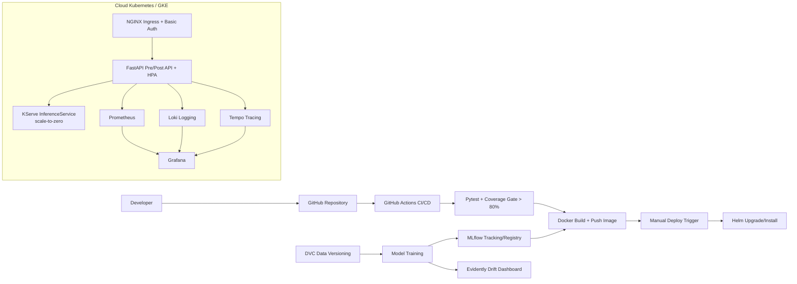

# Personal Cognitive Load & Focus Monitoring System

An end-to-end **Full Stack Data Science / MLOps** project for predicting personal cognitive load from focus time, distraction time, task count, and deadline pressure.

> This is a behavioral monitoring demo for learning MLOps. It is **not** a medical, psychological, or productivity diagnosis system.

---

## Table of Contents

1. [Overview](#overview)
2. [FSDS Requirement Mapping](#fsds-requirement-mapping)
3. [Repository Structure](#repository-structure)
4. [High-Level System Architecture](#high-level-system-architecture)
5. [Local Installation and Run Guide](#local-installation-and-run-guide)
6. [Experiment Workflow: Notebooks, MLflow, and DVC](#experiment-workflow-notebooks-mlflow-and-dvc)
7. [Docker Build](#docker-build)
8. [Cloud Kubernetes Deployment](#cloud-kubernetes-deployment)
9. [Monitoring, Logging, Tracing, and Drift](#monitoring-logging-tracing-and-drift)
10. [CI/CD Pipeline](#cicd-pipeline)
11. [Submission Notes](#submission-notes)

---

## Overview

The system predicts one of three cognitive-load levels:

- `LOW`
- `MEDIUM`
- `HIGH`

The project includes the full path required by the FSDS final project:

```text
Jupyter experiments
→ DVC data/version pipeline
→ MLflow model tracking and registry
→ Docker image build
→ FastAPI pre/post-processing API
→ KServe model serving with scale-to-zero
→ NGINX API gateway with basic authentication
→ Kubernetes HPA autoscaling
→ Prometheus/Grafana metrics
→ Loki logging
→ Tempo tracing
→ Evidently data drift dashboard
→ GitHub Actions test/build/manual deploy pipeline
```

The FastAPI API can run in two modes:

1. **Local mode:** deterministic rule-based fallback, useful for testing and demo.
2. **Kubernetes mode:** pre/post-processing API forwards normalized features to KServe through `KSERVE_PREDICT_URL`.

---

## FSDS Requirement Mapping

| FSDS requirement | Implementation in this repository |
|---|---|
| Python project | Python FastAPI app under `src/preprocessing_api` |
| Pytest testing | `src/tests/` |
| Coverage > 80% | GitHub Actions uses `--cov-fail-under=80` |
| CI/CD test → build → deploy | `.github/workflows/ci-cd.yaml` |
| Automatic build only after tests pass | `build` job depends on `test` job |
| Manual deploy trigger | `workflow_dispatch` deploy job with GitHub environment approval |
| FastAPI pre/post-processing API | `/predict`, `/health`, `/ready`, `/metrics` endpoints |
| HPA autoscaling | `helm/cognitive-load-monitor/templates/hpa.yaml` |
| KServe model serving | `helm/.../inferenceservice.yaml` and `kserve/inferenceservice.yaml` |
| Scale down to 0 | KServe annotation `autoscaling.knative.dev/min-scale: "0"` |
| NGINX API Gateway with auth | Helm Ingress with NGINX basic-auth annotations |
| Metrics monitoring | Prometheus metrics endpoint and Grafana dashboard config |
| Drift monitoring | `scripts/generate_drift_report.py` using Evidently/fallback HTML |
| Tracing | OpenTelemetry OTLP config for Tempo |
| Logging | Structured app logs + Loki/Promtail local config |
| IaC to provision Kubernetes | `infra/terraform/gke/` |
| Kubernetes on cloud | GKE Terraform + GitHub Actions GKE deployment |
| Helm deployment | `helm/cognitive-load-monitor/` |
| MLflow model versioning | `scripts/train_model.py` logs/registers model |
| DVC data versioning | `dvc.yaml`, `.dvc/config`, `params.yaml` |
| Four required notebooks | `notebooks/01_eda.ipynb` through `04_prepare_for_deployment.ipynb` |

---

## Repository Structure

```text
personal-cognitive-load-monitor/
├── .github/workflows/ci-cd.yaml          # Test, Docker build, manual Helm deploy
├── Dockerfile                            # Production FastAPI image
├── Makefile                              # Common local commands
├── README.md
├── dvc.yaml                              # DVC data/model/drift pipeline
├── params.yaml                           # Experiment parameters
├── pyproject.toml                        # uv project metadata and dependency groups
├── data/
│   ├── raw/
│   ├── processed/
│   └── features/
├── docs/
│   └── submission_checklist.md
├── helm/cognitive-load-monitor/          # Helm chart for Kubernetes deployment
│   ├── Chart.yaml
│   ├── values.yaml
│   └── templates/
│       ├── deployment.yaml
│       ├── hpa.yaml
│       ├── ingress.yaml
│       ├── inferenceservice.yaml
│       ├── servicemonitor.yaml
│       └── ...
├── infra/
│   ├── observability/                    # Local Prometheus/Grafana/Loki/Tempo stack
│   └── terraform/gke/                    # GKE cloud Kubernetes IaC
├── kserve/inferenceservice.yaml          # Standalone KServe example
├── notebooks/
│   ├── 01_eda.ipynb
│   ├── 02_data_processing.ipynb
│   ├── 03_model_training.ipynb
│   └── 04_prepare_for_deployment.ipynb
├── scripts/
│   ├── deploy.sh
│   ├── download_model_from_mlflow.py
│   ├── generate_drift_report.py
│   ├── local_smoke_test.sh
│   └── train_model.py
└── src/
    ├── data_generator.py
    ├── preprocessing_api/
    │   ├── main.py
    │   ├── model_client.py
    │   ├── observability.py
    │   ├── schemas.py
    │   └── service.py
    └── tests/
        ├── conftest.py
        └── test_api.py
```

---

## High-Level System Architecture



---

## Local Installation and Run Guide

### 1. Create the uv environment

This repository is **uv-first**. Use `uv sync` and `uv run` for dependency management and commands.

Install uv if it is not already installed:

```bash
# macOS option 1
brew install uv

# macOS/Linux option 2
curl -LsSf https://astral.sh/uv/install.sh | sh
```

Create/sync the local environment from `pyproject.toml`:

```bash
uv sync --all-extras
```

### 2. Run tests with coverage gate

```bash
uv run pytest src/tests \
  --cov=src/preprocessing_api \
  --cov-report=term-missing \
  --cov-fail-under=80
```

Or use:

```bash
make test
```

### 3. Run the FastAPI service locally

```bash
uv run uvicorn preprocessing_api.main:app --host 0.0.0.0 --port 8000 --reload
```

### 4. Test the prediction endpoint

```bash
curl -X POST http://127.0.0.1:8000/predict \
  -H "Content-Type: application/json" \
  -d '{
    "focus_minutes": 120,
    "distraction_minutes": 30,
    "tasks_due": 3,
    "hours_to_deadline": 24
  }'
```

Expected response:

```json
{"cognitive_load_level":"MEDIUM"}
```

### 5. Check service health and metrics

```bash
curl http://127.0.0.1:8000/health
curl http://127.0.0.1:8000/ready
curl http://127.0.0.1:8000/metrics
```

---

## Experiment Workflow: Notebooks, MLflow, and DVC

The required notebooks are in `notebooks/`:

1. `01_eda.ipynb` — exploratory data analysis.
2. `02_data_processing.ipynb` — cleaning, feature engineering, train/test split.
3. `03_model_training.ipynb` — training and evaluation.
4. `04_prepare_for_deployment.ipynb` — model export/deployment preparation.

Train and register a model with MLflow:

```bash
uv run --extra dev python scripts/train_model.py \
  --input data/raw/sample_data.csv \
  --output models/cognitive_load_model.joblib
```

Run the DVC pipeline:

```bash
uv run --extra dev dvc repro
```

Configure a real DVC remote before production use:

```bash
uv run --extra dev dvc remote modify storage url s3://YOUR_BUCKET/personal-cognitive-load-monitor
```

---

## Docker Build

Build the local image. The Dockerfile installs dependencies with `uv sync --no-dev` from `pyproject.toml`:

```bash
docker build -t cognitive-load-api:local .
```

Run it:

```bash
docker run --rm -p 8000:8000 cognitive-load-api:local
```

Build while pulling a model artifact from MLflow:

```bash
docker build \
  --build-arg MLFLOW_TRACKING_URI=http://YOUR_MLFLOW_SERVER:5000 \
  --build-arg MODEL_URI=models:/cognitive-load-classifier/Production \
  -t cognitive-load-api:mlflow .
```

---

## Cloud Kubernetes Deployment

This repository uses **GKE** as the cloud Kubernetes example.

### 1. Provision Kubernetes with Terraform

```bash
cd infra/terraform/gke
cp terraform.tfvars.example terraform.tfvars
# Edit terraform.tfvars with your GCP project ID
terraform init
terraform plan
terraform apply
```

### 2. Install platform dependencies

Install NGINX Ingress:

```bash
helm repo add ingress-nginx https://kubernetes.github.io/ingress-nginx
helm repo update
helm upgrade --install ingress-nginx ingress-nginx/ingress-nginx \
  --namespace ingress-nginx \
  --create-namespace
```

Install KServe and its dependencies according to your cluster setup. The submitted app chart already contains the `InferenceService`; the cluster must have KServe CRDs installed before applying it.

Install metrics server for HPA:

```bash
kubectl apply -f https://github.com/kubernetes-sigs/metrics-server/releases/latest/download/components.yaml
```

### 3. Deploy the application with Helm

```bash
helm upgrade --install cognitive-load-monitor ./helm/cognitive-load-monitor \
  --namespace cognitive-load \
  --create-namespace \
  --set image.repository=ghcr.io/YOUR_GITHUB_USER/YOUR_REPO/cognitive-load-api \
  --set image.tag=latest \
  --set ingress.hosts[0].host=cognitive-load.example.com \
  --set kserve.storageUri=gs://YOUR_MODEL_BUCKET/models/cognitive-load-classifier
```

Replace the demo basic-auth password before a real deployment:

```bash
htpasswd -nb admin 'YOUR_STRONG_PASSWORD'
```

Then set the generated value:

```bash
--set-string basicAuth.auth='admin:GENERATED_HASH_HERE'
```

---

## Monitoring, Logging, Tracing, and Drift

### Local observability stack

Start local Prometheus, Grafana, Loki, Promtail, and Tempo:

```bash
cd infra/observability
docker compose -f docker-compose.observability.yml up -d
```

Then open:

```text
Grafana:    http://localhost:3000    admin/admin
Prometheus: http://localhost:9090
Loki:       http://localhost:3100
Tempo:      http://localhost:3200
```

The API exposes Prometheus metrics at:

```text
/metrics
```

### Drift dashboard

After generating processed train/test data, create a drift report:

```bash
uv run --extra dev python scripts/generate_drift_report.py \
  --reference data/processed/train.csv \
  --current data/processed/test.csv \
  --output reports/evidently/data_drift.html
```

Open:

```text
reports/evidently/data_drift.html
```

---

## CI/CD Pipeline

The GitHub Actions workflow is in:

```text
.github/workflows/ci-cd.yaml
```

Pipeline behavior:

The GitHub Actions workflow installs and caches dependencies with `uv` using `pyproject.toml`.

1. Pull request or push starts the `test` job.
2. `test` runs Pytest and fails if coverage is below 80%.
3. `build` runs only after tests pass. It starts a self-contained MLflow tracking
   server for the duration of the job, trains the model against it (registering a
   new version of `cognitive-load-classifier`), then downloads that exact
   registered version back down via `scripts/download_model_from_mlflow.py` before
   baking it into the Docker image — so "pull the model from MLflow" is a real,
   CI-enforced step (`REQUIRE_MODEL=true`, no silent fallback) on every build, not
   just something the code supports if you happen to run a persistent MLflow
   server. Point the `MLFLOW_TRACKING_URI`/`MODEL_URI` Docker build-args (see
   [Docker Build](#docker-build)) at a real persistent MLflow server instead if you
   have one for production use.
4. `deploy` runs only from manual `workflow_dispatch`.
5. `deploy` uses Helm to deploy to GKE.

Required GitHub secrets for full cloud deployment:

```text
GCP_WORKLOAD_IDENTITY_PROVIDER
GCP_SERVICE_ACCOUNT
GCP_PROJECT_ID
GKE_CLUSTER
GKE_LOCATION
KSERVE_STORAGE_URI
APP_HOST
MLFLOW_TRACKING_URI
MLFLOW_MODEL_URI
```

For the PR submission, the test/build code is already complete. The deploy job requires your real cloud credentials and host name.

---

## Submission Notes

Before submitting the FSDS PR link:

1. Push this code to a feature branch, for example `feature/full-fsds-mlops`.
2. Open a pull request into `main`.
3. Confirm the GitHub Actions test job passes with coverage above 80%.
4. Add your actual PR link here:

```text
PR Link: TODO - paste your GitHub pull request link here
```

Optional demo video checklist:

```text
1. Show README and architecture.
2. Run Pytest with coverage.
3. Run FastAPI locally and call /predict.
4. Show Docker build.
5. Show Helm template or Kubernetes deployment.
6. Show Grafana dashboard and Evidently drift report.
7. Show GitHub Actions test/build/manual deploy pipeline.
```
